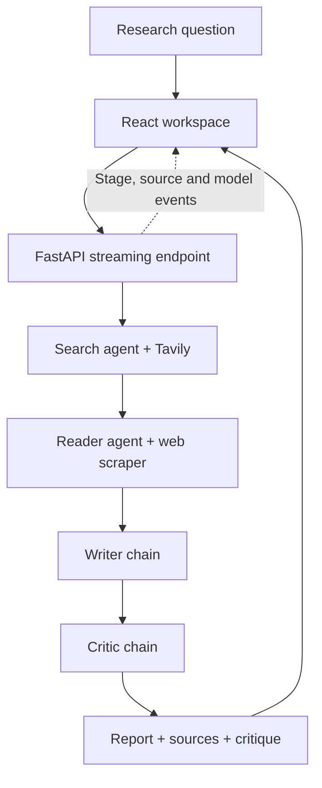

<div align="center">

# DeepScout

**From a research question to a structured report—with sources, live progress and a critic review.**


[Overview](#overview) · [How it works](#how-it-works) · [Quick start](#quick-start) · [API](#api) · [Project structure](#project-structure)

</div>

## Overview

DeepScout is a full-stack AI research assistant that searches the web, reads a relevant source, drafts a structured briefing and reviews the result for weaknesses. A React workspace displays each stage as it runs, then presents the report, source links, critique and intermediate research material.

The backend combines tool-using LangChain agents with writer and critic chains. Gemini is the primary model provider; a failed stage can retry through OpenRouter, which then handles the remaining stages of that run.

## Features

- **Web-backed research:** Tavily returns titles, URLs and snippets, with up to five results per search tool call.
- **Focused source reading:** a reader agent selects a relevant URL and uses Requests and Beautiful Soup to extract page text.
- **Structured reports:** the writer is prompted to produce an introduction, at least three key findings, a conclusion and source URLs.
- **Separate critique:** a second pass requests a score out of ten, strengths, areas to improve and a verdict.
- **Live execution trace:** Server-Sent Events carry stage updates, discovered sources and model switches to the browser.
- **Provider fallback:** stage exceptions or detected empty output trigger a retry through OpenRouter; the run stays on the fallback after switching.
- **Research workspace:** Report, Sources, Critique and Raw views keep findings and supporting material accessible.
- **Markdown export:** copy a completed report or download it as a `.md` file.
- **Recent queries:** up to 12 distinct queries are stored in browser local storage for reuse.
- **Responsive interface:** a dark workspace with a collapsible mobile sidebar, keyboard submission and loading states.

## How it works



The pipeline executes sequentially: **search → read → write → critique**. The search stage collects evidence and source links; the reader is instructed to inspect the most relevant URL. The writer combines search output with the reader's response, and the critic evaluates the resulting draft.

Progress is streamed at the stage level. Report tokens are not streamed individually, and the critic's feedback is displayed separately rather than automatically rewriting the report.

### Model routing

Every run starts with Gemini. If a stage raises an exception or fails its output check, the pipeline retries that stage with the fallback and uses it for the rest of the run. If the fallback fails, the run stops with an error.

**Configuration detail:** the code and interface call the fallback **Mistral**, but `OPENROUTER_MODEL` defaults to `openrouter/free`. The actual model therefore depends on OpenRouter routing or your configured model ID. Set this variable to a supported Mistral model ID if you want the label to match the underlying model.

## Tech stack

| Layer | Technologies |
| --- | --- |
| Frontend | React 19, TypeScript, Vite 7 |
| Styling and components | Tailwind CSS 4, Radix UI, Lucide icons |
| Report rendering | React Markdown, remark-gfm |
| Backend | Python, FastAPI, Uvicorn, Pydantic |
| AI orchestration | LangChain agents and prompt chains |
| Model access | Google Gemini; OpenRouter through LangChain's OpenAI-compatible client |
| Search and extraction | Tavily, Requests, Beautiful Soup |
| Live updates | Server-Sent Events consumed through browser Fetch |
| Local persistence | Browser local storage for recent query text |

## Quick start

### Prerequisites

- Python **3.10 or newer**.
- Node.js **22.12 or newer** with npm; see [Vite's runtime requirements](https://vite.dev/guide/).
- A Tavily API key and a Google API key with access to a Gemini model.
- An OpenRouter API key to enable fallback.

### 1. Get the project

```bash
git clone https://github.com/BoGeYmAn04/DeepScout.git
cd DeepScout
```

If you already have the project locally, open its root folder instead.

### 2. Prepare the backend

```bash
cd Server
python -m venv .venv
```

Activate the environment using the command for your shell:

```powershell
# Windows PowerShell
.\.venv\Scripts\Activate.ps1
```

```bash
# macOS / Linux
source .venv/bin/activate
```

Install the backend dependencies:

```bash
python -m pip install -r requirements.txt
```

Use `requirements.txt` for the application setup: `pyproject.toml` currently lists only part of the backend's dependencies.

Create `Server/.env` with your own values:

```dotenv
GOOGLE_API_KEY=your_google_api_key
GEMINI_MODEL=your_available_gemini_model_id
TAVILY_API_KEY=your_tavily_api_key
OPENROUTER_API_KEY=your_openrouter_api_key
OPENROUTER_MODEL=openrouter/free
FRONTEND_URL=http://127.0.0.1:5173
```

Replace `your_available_gemini_model_id` with a model available to your account. The code's default is `gemini-3.6-flash`; that default is not a guarantee of model availability.

Start the API from inside `Server`:

```bash
python -m uvicorn main:app --reload --host 127.0.0.1 --port 8000
```

API: [http://127.0.0.1:8000](http://127.0.0.1:8000) · Interactive docs: [http://127.0.0.1:8000/docs](http://127.0.0.1:8000/docs)

### 3. Start the frontend

Open a second terminal in the project root:

```bash
cd Client
npm ci
```

Create `Client/.env`:

```dotenv
VITE_API_URL=http://127.0.0.1:8000
```

```bash
npm run dev
```

Open [http://127.0.0.1:5173](http://127.0.0.1:5173), enter a question and press **Enter**. Use **Shift + Enter** for a new line. For example:

> What are the latest breakthroughs in solid-state batteries?

Follow the four stages, review the report and sources, then open the critique or export the report. Selecting a recent query fills the input so you can run it again; it does not restore a saved report.

## Configuration

| Variable | Location | Purpose / default |
| --- | --- | --- |
| `GOOGLE_API_KEY` | `Server/.env` | Credential for the primary Gemini provider |
| `GEMINI_MODEL` | `Server/.env` | Gemini model ID; code default: `gemini-3.6-flash` |
| `TAVILY_API_KEY` | `Server/.env` | Credential for web search |
| `OPENROUTER_API_KEY` | `Server/.env` | Credential for fallback model access |
| `OPENROUTER_MODEL` | `Server/.env` | Fallback model ID; default: `openrouter/free` |
| `FRONTEND_URL` | `Server/.env` | Additional allowed frontend origin for CORS |
| `VITE_API_URL` | `Client/.env` | Backend origin; default: `http://localhost:8000` |

Local origins `http://localhost:5173` and `http://127.0.0.1:5173` are already allowed. Restart the relevant development server after changing configuration. Keep provider keys in the backend environment; `VITE_` variables are exposed to the client build.

## API

| Method | Endpoint | Response |
| --- | --- | --- |
| `GET` | `/` | API name, status and documentation path |
| `GET` | `/api/health` | `{"status":"ok"}` |
| `POST` | `/api/research` | Completed research result as JSON |
| `POST` | `/api/research/stream` | SSE progress events followed by a result or error |

Both research endpoints accept a JSON body with a `query` string of **3–1,000 characters**:

```json
{
  "query": "How are AI agents changing software engineering?"
}
```

Try a request from PowerShell:

```powershell
$body = @{ query = "How are AI agents changing software engineering?" } | ConvertTo-Json
Invoke-RestMethod -Uri http://127.0.0.1:8000/api/research -Method Post -ContentType "application/json" -Body $body
```

The completed result contains `query`, `search_results`, `scraped_content`, `research_report`, `critic_feedback`, `sources`, `final_model`, `fallback_triggered` and `models_used`. The API returns at most 20 source URLs. `scraped_content` contains the reader agent's final response, which may summarize the scraped text.

Streaming events use these types:

| Event | Contents |
| --- | --- |
| `stage` | Stage name, status and progress message |
| `sources` | Discovered source URLs |
| `model` | Provider label, fallback flag and optional context |
| `complete` | The full normalized result under `result` |
| `error` | Error text under `message` |

The streaming route is a **POST** endpoint consumed with Fetch, rather than a native `EventSource` GET connection.

## Project structure

```text
DeepScout/
├── Client/
│   ├── public/logo.svg
│   ├── src/
│   │   ├── components/       # Workspace, report, sources, trace and UI primitives
│   │   ├── lib/api.ts        # Health check and SSE consumer
│   │   ├── types/research.ts # Results, stages and stream-event types
│   │   └── App.tsx           # Session state and local query history
│   ├── package.json
│   └── vite.config.ts
├── Server/
│   ├── app/
│   │   ├── agents/           # Search and reader agents
│   │   ├── chains/           # Writer and critic chains
│   │   ├── llm/              # Gemini and OpenRouter clients
│   │   ├── prompts/          # Report and critique instructions
│   │   ├── tools/            # Tavily search and HTML extraction
│   │   └── pipeline.py       # Sequential execution, fallback and progress events
│   ├── main.py               # FastAPI routes, CORS and streaming
│   ├── requirements.txt
│   ├── pyproject.toml
│   └── test.py               # Manual OpenRouter connectivity check
└── Readme.md
```

## Development commands

Run from `Client`:

```bash
npm run lint       # ESLint
npm run build      # TypeScript checks and production build
npm run preview    # Preview the built frontend locally
```

The frontend build is written to `Client/dist`. For a hosted frontend, set `VITE_API_URL` before building and set the backend's `FRONTEND_URL` to the frontend origin. The host or proxy must support long-lived SSE responses without buffering.

Run `python test.py` from `Server` for a manual OpenRouter connectivity check. It makes a real model request using your configured credentials; it is not an automated test suite. The health endpoint checks that the API is responding, not that every external provider is working.

## Current scope

- The scraper retrieves static HTML, uses an eight-second timeout and keeps the first 3,000 characters of extracted text. JavaScript-rendered and inaccessible pages may yield incomplete material.
- Tool failures are returned as text, so a failed search or scrape may still reach later stages. Provider fallback does not guarantee recovery from every source-access failure.
- The critic is an LLM review pass, not an independent verification of every claim. Check the linked evidence before relying on a report.
- Recent history stores query text in the browser. Reports are not persisted to a database.
- Resetting the interface aborts the browser request; it does not cancel an already-running backend worker.
- The current API has no authentication or rate limiting. These are deployment work items before making a public service available.

